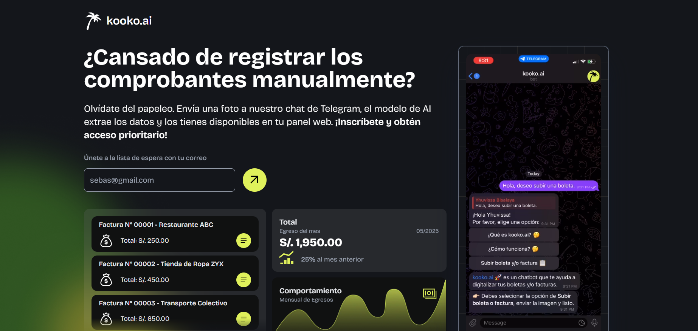

# kooko.ai

> Front-end of the kooko.ai platform

> Developed by [Sebastian Marat Urdanegui Bisalaya](https://sebastianurdanegui.vercel.app/)

> kooko.ai is a web platform designed to visualize and manage financial data extracted from receipts and invoices. This frontend application provides a user-friendly dashboard with key metrics, detailed transactions, and filtering capabilities.

## Technologies

- **React.js:** A JavaScript library for building user interfaces.
- **Next.js:** A React framework for building server-side rendered and static web applications.
- **TypeScript:** A superset of JavaScript that adds static types.
- **Tailwind CSS:** A utility-first CSS framework for rapidly building custom designs.
- **Supabase:** Used for backend services, incluiding database interactions and authentication.

## Features

- **Dashboard Overview:** View key financial metrics such as total expenses and total expenses by type.

- **Date Filtering:** Easily filter financial data by specific date ranges to gain insights over time.

- **Transaction Details:** Display general extracted data in rows, with the ability to view more specific information for each transaction.

- **Supabase Integration:** Securely interact with the Supabase database using Next.js server APIs for all data transactions.

- **Responsive Design:** Built with Tailwind CSS to ensure a seamless experience across various devices.

## Landing Page

## Web App

